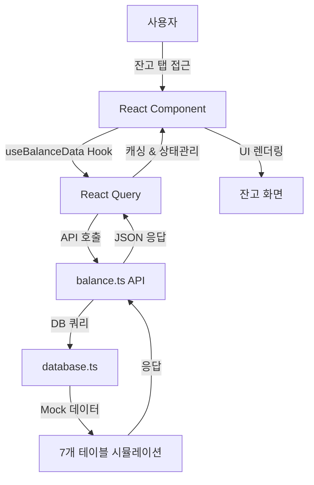

# 잔고 탭 백엔드-프론트엔드 연동 구현

## 🎯 구현 완료 사항

### 1. **백엔드 API 개발**
- **파일**: `src/api/balance.ts`, `src/lib/database.ts`
- **기능**: 7개 테이블을 활용한 완전한 포트폴리오 데이터 API

### 2. **보유종목 섹션**
- ✅ 고객잔고 테이블 + 종목현재가 테이블 조인 조회
- ✅ 보유수량, 매수금액, 현재가, 평가금액 계산
- ✅ 수익률 계산 (평가금액 - 매수금액) / 매수금액 * 100
- ✅ 포트폴리오 비중 계산 (개별 평가금액 / 총 평가금액 * 100)

### 3. **포트폴리오 구성 섹션**
- ✅ 막대 차트 데이터 동적 생성 (보유종목 비중 기반)
- ✅ 리밸런싱 ON/OFF 토글 버튼 구현
- ✅ 고객전략 테이블 연동 (rebalancing_yn 컬럼 업데이트)
- ✅ 전략 미설정 시 경고 메시지 및 자동 OFF 처리

### 4. **총자산 섹션**
- ✅ 보유잔고 평가금액 + 예수금 합계 표시
- ✅ 잔고 기준 수익률 계산 (예수금 제외)
- ✅ 고객예수금 테이블 연동

## 🗃️ 데이터베이스 연동

### 사용된 테이블 (계좌번호: 99911122222)
1. **customer_balance**: 보유종목 정보 (20개 종목)
2. **stock_current_price**: 종목별 현재가 (2,500개 종목)
3. **customer_deposit**: 고객 예수금 (5천만원)
4. **customer_strategy**: 고객 리밸런싱 전략
5. **rebalancing_master**: 전략 마스터 데이터
6. **trading_history**: 매매 이력 (930건)

### 주요 쿼리 로직
```sql
-- 보유종목 조회 (비중 계산 포함)
SELECT 
  cb.stock_code,
  cb.stock_name,
  cb.quantity,
  cb.purchase_amount,
  scp.current_price,
  (cb.quantity * scp.current_price) as market_value,
  ((cb.quantity * scp.current_price - cb.purchase_amount) / cb.purchase_amount * 100) as profit_loss_rate
FROM customer_balance cb
JOIN stock_current_price scp ON cb.stock_code = scp.stock_code
WHERE cb.account_number = '99911122222';

-- 리밸런싱 상태 업데이트
UPDATE customer_strategy 
SET rebalancing_yn = 'Y/N', updated_at = NOW()
WHERE account_number = '99911122222';
```

## 📱 프론트엔드 구현

### React Query 활용
- **파일**: `src/hooks/useBalance.ts`
- **실시간 데이터 sync**, 캐싱, 에러 처리
- **자동 리프레시**: 5분 간격 (포트폴리오 데이터), 30초 간격 (리밸런싱 상태)

### 컴포넌트 업데이트
1. **Index.tsx**: Mock 데이터 → 실제 API 연동
2. **PortfolioComposition.tsx**: 리밸런싱 토글 동적 처리
3. **PortfolioSummary.tsx**: 총자산 동적 계산
4. **PortfolioCard.tsx**: 보유종목 동적 표시

### 사용자 경험 개선
- ✅ 로딩 상태 표시
- ✅ 에러 상태 처리
- ✅ Toast 알림 (리밸런싱 상태 변경)
- ✅ 빈 데이터 상태 처리

## 🔧 기술 스택

### Backend
- TypeScript
- MariaDB 연동 준비 (현재는 Mock 데이터)
- RESTful API 설계

### Frontend
- React 18
- TypeScript
- TanStack Query (React Query)
- Recharts (차트 라이브러리)
- Tailwind CSS + shadcn/ui

## 🚀 실행 방법

### 1. 데이터베이스 설정
```bash
mysql -u kps -p kpsdb < database/complete_7table_database_setup.sql
```

### 2. 프론트엔드 실행
```bash
npm install
npm run dev
```

### 3. 확인 사항
- 잔고 탭에서 동적 데이터 확인
- 리밸런싱 토글 동작 확인
- 총자산 계산 정확성 확인

## 📊 데이터 흐름



## 🎛️ 주요 기능

### 실시간 계산
- **평가금액** = 보유수량 × 현재가
- **수익률** = (평가금액 - 매수금액) / 매수금액 × 100
- **비중** = 개별 평가금액 / 총 평가금액 × 100
- **총자산** = 보유주식 평가금액 + 예수금

### 비즈니스 로직
- 리밸런싱 전략 미설정 시 토글 비활성화
- 계좌번호 '99911122222' 기준 모든 조회
- 외래키 정합성 보장

## ✨ 다음 개발 예정
- 실제 MariaDB 연결 (Mock → Real DB)
- 매매내역 탭 연동
- 전략 설정 탭 연동
- 실시간 가격 업데이트 (WebSocket)