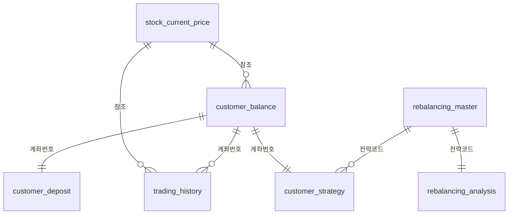

# 포트폴리오 관리 시스템 데이터베이스 스키마 (7개 테이블)

## 테이블 관계도



## 7개 테이블 구성

### 1. 종목현재가 (stock_current_price)
- **목적**: 전체 상장 주식의 실시간 가격 정보
- **데이터**: 2,500개 종목 (000001~002500)
- **PK**: stock_code

### 2. 고객잔고 (customer_balance) 
- **목적**: 고객별 보유 주식 현황
- **데이터**: 계좌 99911122222의 20개 보유 종목
- **PK**: id (auto_increment)
- **UK**: (account_number, stock_code)

### 3. 고객예수금 (customer_deposit) ⭐ NEW
- **목적**: 고객별 예수금 관리 (주식 매매를 위한 현금)
- **구성**: 
  - 총예수금 (deposit_amount): 5천만원
  - 인출가능금액 (available_amount): 4천5백만원  
  - 동결금액 (frozen_amount): 5백만원
- **PK**: account_number
- **제약**: deposit_amount = available_amount + frozen_amount

### 4. 매매내역 (trading_history)
- **목적**: 고객의 주식 매매 거래 이력
- **데이터**: 930건의 매수/매도 거래
- **PK**: (account_number, trading_date, order_number, execution_number)

### 5. 리밸런싱마스터 (rebalancing_master)
- **목적**: 포트폴리오 리밸런싱 전략 정의
- **데이터**: 15개 투자 전략 (안정형, 성장형, 배당형 등)
- **PK**: rebalancing_strategy_code

### 6. 리밸런싱분석 (rebalancing_analysis)
- **목적**: 각 전략별 수익률, 위험도 분석 데이터
- **데이터**: 15개 전략별 분석 지표
- **PK**: rebalancing_strategy_code

### 7. 고객전략 (customer_strategy)
- **목적**: 고객이 선택한 리밸런싱 전략
- **데이터**: 계좌 99911122222의 BALANCED_01 전략 적용
- **PK**: account_number

## 주요 외래키 관계

1. **customer_deposit → customer_balance**: account_number
2. **customer_balance → stock_current_price**: stock_code  
3. **trading_history → stock_current_price**: stock_code
4. **trading_history → customer_balance**: account_number
5. **customer_strategy → rebalancing_master**: rebalancing_strategy_code
6. **rebalancing_analysis → rebalancing_master**: rebalancing_strategy_code

## 비즈니스 로직

### 예수금 관리
- **총예수금**: 고객이 주식 매매를 위해 예치한 현금
- **인출가능금액**: 실제 인출 가능한 금액
- **동결금액**: 주문 대기 중이거나 기타 사유로 동결된 금액
- **제약조건**: 총예수금 = 인출가능금액 + 동결금액

### 포트폴리오 관리 프로세스
1. 고객이 예수금을 입금 (customer_deposit)
2. 예수금으로 주식을 매수 (trading_history → customer_balance)
3. 보유 주식의 현재 가치를 실시간 확인 (stock_current_price)
4. 리밸런싱 전략에 따라 포트폴리오 조정 (customer_strategy)

## 실행 방법

```bash
mysql -u kps -p kpsdb < complete_7table_database_setup.sql
```

완전한 7개 테이블 포트폴리오 관리 시스템이 구축됩니다.